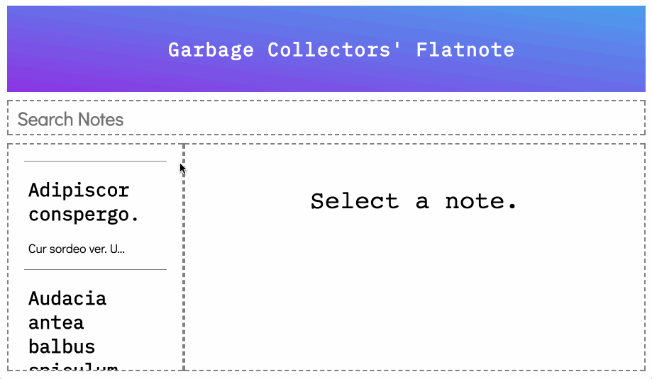
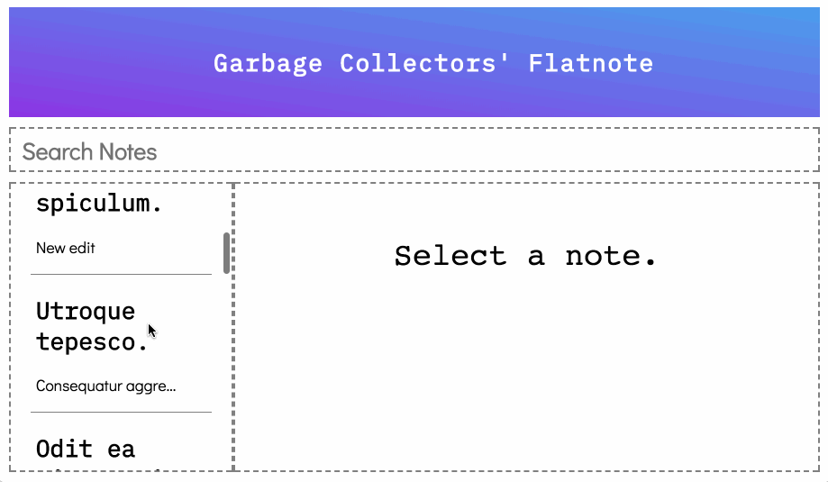

# README: React Evernote

Your goal will be to complete the baseline deliverables using the provided starter code and then make this project your own by building out unique stretch goals. Some suggestions are listed below, but try to be creative!

## Requirements

- [ ] Complete all of the _Deliverables_.
- [ ] Build out at least 1 stretch goal feature.

## Setup

The codebase should be split up into a Rails API backend and a React frontend. Everything should be contained in this single repository. Your Rails code is located inside of the `backend` folder and your React code is located inside of the `frontend` folder.

### Frontend

```sh
# from within this directory:
create-react-app frontend
npm # or `yarn`
PORT=4000 npm start
```

### Backend

```sh
# from within this directory:
rails new backend
```

## Base Deliverables

### Domain Model

- A `User` has many `Note`s
- A `Note` belongs to a `User`

### Routes

| Method | Route               |                                 Headers                                 |         Body         |
| ------ | ------------------- | :---------------------------------------------------------------------: | :------------------: |
| GET    | `/api/v1/users`     |                                                                         |                      |
| GET    | `/api/v1/notes`     |                                                                         |                      |
| POST   | `/api/v1/notes`     | `'Content-Type': 'application/json'`<br/>`'Accept': 'application/json'` | title, body, user_id |
| PATCH  | `/api/v1/notes/:id` | `'Content-Type': 'application/json'`<br/>`'Accept': 'application/json'` | title, body, user_id |

> **Tip:** Test out your routes with [Postman](https://www.getpostman.com/) to see how they work and what they return.

### Wireframes

Look at the gif below to see how the app should look and behave. These are the baseline deliverables you need to complete:

**Viewing and Displaying Notes**

- [ ] Display all notes in the left sidebar.
- [ ] Displayed sidebar notes should show the title and a truncated body.
- [ ] When clicking a note from the sidebar, display its contents in the right panel.


**Editing Notes**

- [ ] When displaying a note in the right panel, show an `Edit` button.
- [ ] Clicking the `Edit` button will allow the user to edit the title and body in the right panel.
- [ ] When in edit mode, also show a `Save` button which saves the note via a `PATCH` request.
- [ ] When in edit mode, also show a `Cancel` button which discards any changes and reverts back to displaying the note.
- [ ] Clicking a different note while in edit mode should discard your changes and display the new note instead.



**Creating Notes**

- [ ] At the bottom of your left sidebar, show a `New` button.
- [ ] Clicking `New` will create a new note via `POST` request with some default title and body.
- [ ] This new note should appear in the sidebar.


**Filtering Notes**

- [ ] Implement the filter to search through your notes list by title.



## Stretch Goals

When you are finished with the _deliverables_, you can build out any new features that you want. This is your chance to be creative and make your project unique!

Some suggestions:

- Add the ability to filter by body, date created, date edited, etc.
- Sorting by date created, date edited, alphabetical, etc.
- Use `react-router` to create a multi-page app
- User signup & login
- Sharing notes with other users
- Rich text formatting
- Tagging
- Emailing notes
